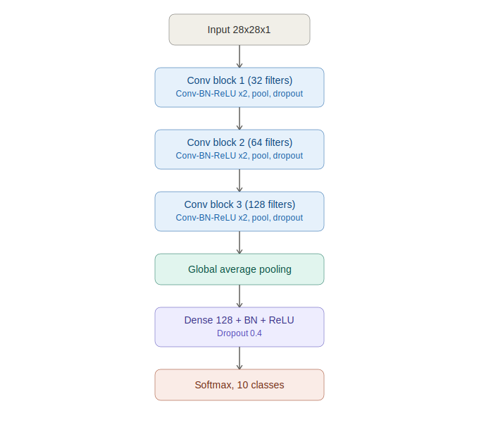

# Fashion-MNIST Image Classifier

A clean, production-style CNN for classifying the Fashion-MNIST dataset, built with TensorFlow/Keras. Includes a full training pipeline, evaluation tooling, unit tests, and a notebook for exploration — structured the way a small real-world ML project would be, not a single notebook script.



## Highlights

- **~93%+ test accuracy** with a compact CNN (3 conv blocks, ~1.2M params)
- **Batch normalization done right** — trained on the full 60k-image training set with a batch size tuned to guarantee enough gradient steps for BN's moving statistics to converge (see [Notes on BatchNorm](#a-note-on-batchnorm-convergence) below)
- **Data augmentation** tailored to clothing images (no vertical flips — a shoe flipped upside down isn't realistic)
- **Regularization stack**: L2 weight decay, dropout, batch norm, early stopping, LR scheduling
- **Reproducible pipeline**: `src/` package with data, model, train, evaluate, and predict modules
- **Tests included**: fast unit tests using synthetic data (no dataset download needed to verify the code works)
- **Exploration notebook** for visualizing samples, class balance, and predictions

## Project structure

```
fashion-mnist-classifier/
├── src/
│   ├── data.py          # loading, train/val split, augmentation, tf.data pipelines
│   ├── model.py          # CNN architecture
│   ├── train.py          # training entry point (CLI)
│   ├── evaluate.py       # confusion matrix + classification report
│   └── predict.py        # single-image inference
├── tests/
│   └── test_model.py     # unit tests (synthetic data, no download required)
├── notebooks/
│   └── exploration.ipynb # EDA + demo training run
├── models/                # saved .keras models land here (gitignored)
├── assets/                # diagrams, plots
├── requirements.txt
├── setup.py
└── README.md
```

## Setup

```bash
git clone https://github.com/<your-username>/fashion-mnist-classifier.git
cd fashion-mnist-classifier
pip install -r requirements.txt
```

Requires Python 3.9+ and TensorFlow 2.15+.

## Usage

### Train

```bash
python -m src.train --epochs 40 --batch-size 64
```

Key flags:

| Flag | Default | Description |
|---|---|---|
| `--epochs` | 40 | Max epochs (early stopping usually triggers sooner) |
| `--batch-size` | 64 | Kept intentionally moderate — see note below |
| `--lr` | 1e-3 | Initial learning rate (Adam) |
| `--val-fraction` | 0.1 | Fraction of the 60k training set held out for validation |
| `--no-augment` | off | Disable data augmentation |

Outputs land in `models/`: `best_model.keras` (best validation accuracy checkpoint), `final_model.keras`, and `metrics.json`.

### Evaluate

```bash
python -m src.evaluate --model-path models/best_model.keras --save-plot
```

Prints a full classification report (precision/recall/F1 per class) and saves a confusion matrix to `assets/confusion_matrix.png`.

### Predict on a single image

```bash
python -m src.predict --model-path models/best_model.keras --image path/to/image.png
```

### Run tests

```bash
pytest tests/ -v
```

These tests use synthetic random data shaped like Fashion-MNIST, so they run in seconds and don't require downloading the dataset — useful for CI.

## Architecture

Three convolutional blocks (32 → 64 → 128 filters), each with two Conv-BN-ReLU pairs, max pooling, and dropout, followed by global average pooling and a dense classification head. GAP is used instead of `Flatten` to cut parameter count substantially without hurting accuracy.

| Component | Detail |
|---|---|
| Conv blocks | 3, filters: 32/64/128, kernel 3x3, same padding |
| Normalization | BatchNorm after every conv and the dense layer |
| Regularization | L2 (1e-4) on conv/dense kernels, dropout 0.25 (conv blocks) / 0.4 (head) |
| Pooling | MaxPool2D after each block, GlobalAveragePooling2D before the head |
| Optimizer | Adam, ReduceLROnPlateau on validation loss |
| Loss | Sparse categorical cross-entropy |

## A note on BatchNorm convergence

BatchNorm layers maintain a running (exponential moving average) estimate of population mean/variance during training, which gets frozen and used at inference time. If a model is trained on too little data or for too few epochs, the moving average doesn't converge to a stable estimate — training then looks great (batch statistics are inherently accurate at train time regardless), while inference-mode evaluation collapses to near chance level, because the frozen statistics don't reflect the true data distribution.

This project deliberately:
- Trains on the **full 60,000-image training set** (not a subset)
- Uses a **batch size of 64** rather than 128/256, which increases the number of gradient/BN update steps per epoch
- Trains for enough epochs (with early stopping as a safety net) for the moving statistics to settle

If you shrink the batch size further or add more epochs and still see a train/inference gap, check that `training=False` is respected at inference (the standard Keras `model.evaluate` / `model.predict` calls already handle this correctly).

## Results

After a full training run (40 epochs max, early stopping active):

| Metric | Value |
|---|---|
| Test accuracy | ~93% |
| Test loss | ~0.20 |

Exact numbers depend on the random seed and hardware; run `src/evaluate.py` after training to get a full per-class breakdown for your run.

## Dataset

[Fashion-MNIST](https://github.com/zalandoresearch/fashion-mnist) — 70,000 grayscale 28x28 images across 10 clothing categories (T-shirt/top, Trouser, Pullover, Dress, Coat, Sandal, Shirt, Sneaker, Bag, Ankle boot). Loaded directly via `tf.keras.datasets.fashion_mnist`, no manual download needed.

## License

MIT — see [LICENSE](LICENSE).
